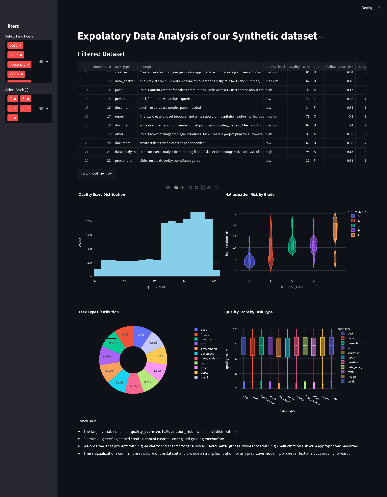

# Prompt Evaluation EDA & Dashboard



This repository contains a comprehensive Exploratory Data Analysis (EDA) and an interactive Streamlit Dashboard for evaluating prompt quality. It analyzes key metrics such as **quality score**, **hallucination risk**, **clarity**, **specificity**, and **structure** to help identify patterns in successful AI prompting.

## 🚀 Features

### 1. Jupyter Notebook EDA (`EDA.ipynb`)

- **Data Cleaning & Feature Engineering**: Processes raw data and handles missing values.
- **Scoring System**: Normalizes rating features to derive a 100-point custom scoring system.
- **Statistical Visualizations**: Includes histograms, box plots, and pie charts analyzing the distribution of various task types and their correlation to hallucination risks.

### 2. Interactive Streamlit Dashboard (`app1.py`)

- **Interactive Interface**: A clean layout displaying the filtered dataset directly.
- **Dynamic Filtering**: Use the sidebar to filter data by **Task Type** and **Grade**.
- **Dataset Export**: Easily download the filtered dataset as a CSV for further offline analysis.
- **Visualizations** (powered by `eda_utils.py`):
  - **Quality Score Distribution**: Histogram of quality scores.
  - **Hallucination Risk by Grade**: Violin plot showcasing hallucination risk.
  - **Task Type Distribution**: Donut chart displaying the proportion of different task types.
  - **Quality Score by Task Type**: Box plot analyzing quality distributions across tasks.

## 🌐 Deployed Link

[View Live Dashboard](https://promptevaluation.streamlit.app/)

## 🛠️ Getting Started

### Prerequisites

Make sure you have Python installed along with the required packages:

```bash
pip install pandas plotly numpy streamlit
```

### Running the Dashboard

To start the interactive Streamlit dashboard, open your terminal, navigate to the project directory, and run:

```bash
streamlit run app1.py
```

This will automatically open the dashboard in your default web browser!

## 📁 Repository Structure

- `EDA.ipynb`: The Jupyter Notebook containing the initial data exploration and visualizations.
- `app1.py`: The main Streamlit application script containing the dashboard UI and logic.
- `eda_utils.py`: A utility script that generates the Plotly visualizations for the dashboard.
- `Cleaned_dataset.csv`: The cleaned dataset used by the dashboard.
- `prompt_evaluation_dataset.csv`: Original raw dataset.
- `prompt_evaluation_training_data.csv`: Training dataset.
- `.gitignore`: Git ignore file to exclude unnecessary files from version control.
